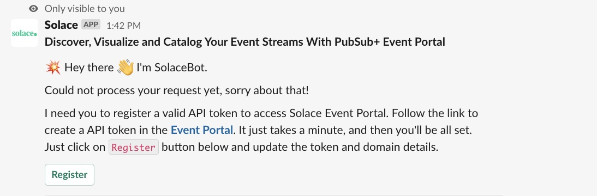
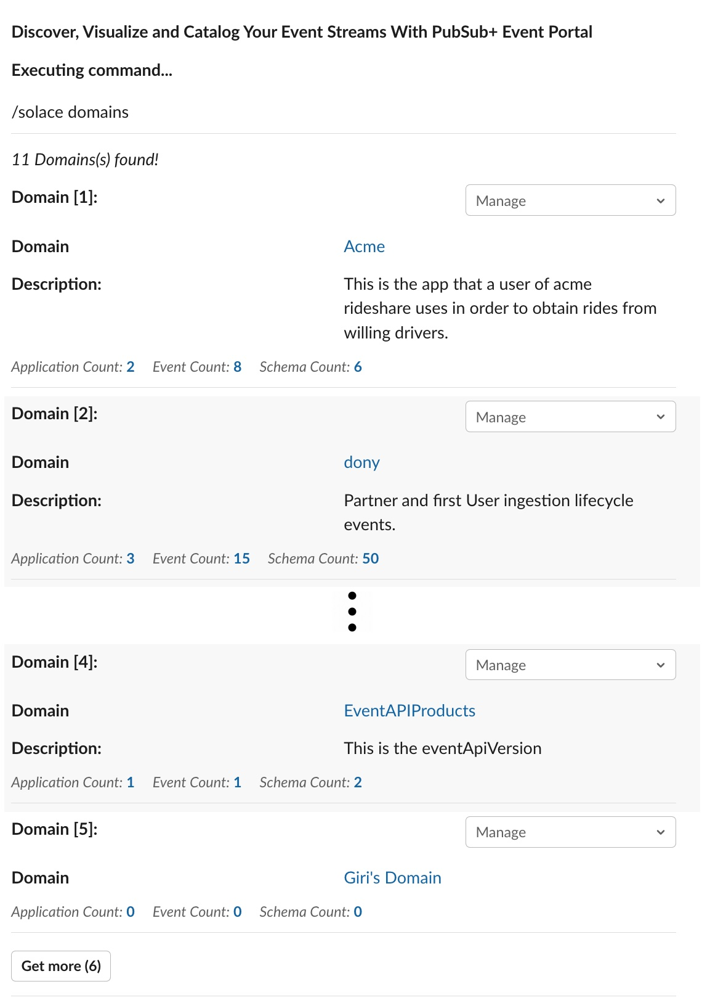
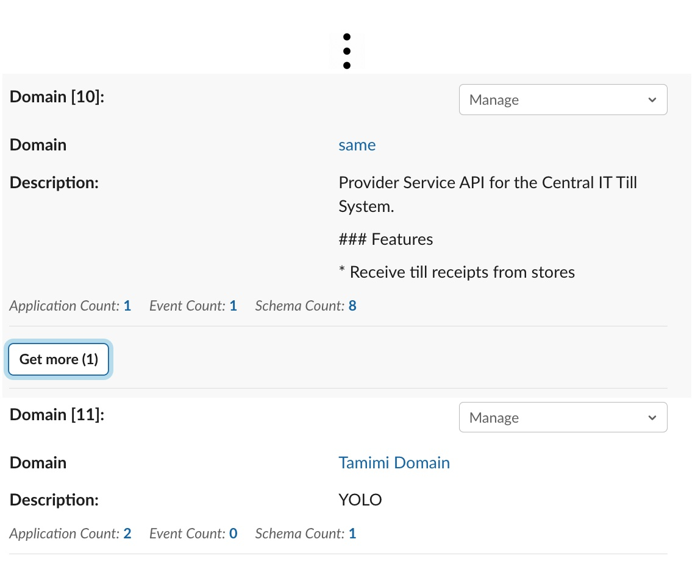

# << IN WORK - NOT YET AVAILABLE ON SLACK APP DIRECTORY >> 

# Solace PubSub+ Event Portal + Slack Integration

## About

The Solace PubSub+ Event Portal integration for Slack gives you and your teams full visibility into your Event Portal resources right in Slack channels, where you can access information about your Application Domains, Applications, Events and Schemas. This integration is an open source project, built and maintained by _Solace-Labs_.

## Table of Contents
- [<< IN WORK - NOT YET AVAILABLE ON SLACK APP DIRECTORY >>](#-in-work---not-yet-available-on-slack-app-directory-)
- [Solace PubSub+ Event Portal + Slack Integration](#solace-pubsub-event-portal--slack-integration)
  - [About](#about)
  - [Table of Contents](#table-of-contents)
  - [Installing the Solace PubSub+ Event Portal integration for Slack](#installing-the-solace-pubsub-event-portal-integration-for-slack)
    - [Requirements](#requirements)
    - [Installation](#installation)
  - [Getting Started](#getting-started)
  - [Features](#features)
    - [Slash commands](#slash-commands)
    - [Message interactions](#message-interactions)
    - [URL Unfurling](#url-unfurling)
    - [Paginated results](#paginated-results)
    - [Help](#help)
    - [Examples](#examples)
  - [Resources](#resources)
      - [Solace Resources](#solace-resources)
      - [Slack resources](#slack-resources)
  - [Contributing](#contributing)
  - [Authors](#authors)
  - [License](#license)

--------
## Installing the Solace PubSub+ Event Portal integration for Slack
### Requirements
This app supports access to Solace PubSub+ Event Portal using Slack. You must have a Solace PubSub+ Cloud subscription and an API token with the following permissions.

To generate a token, click on the User icon at the bottom of the sidebar and choose _Token Management_

In the *Create Token* page, grant permissions under _Event Portal_ -> _Designer Read_ group for the following options.

Create the token and save it in a file, you would need to specify this token when registering for Solace Slack App.

### Installation
[Install the Solace PubSub+ Event Portal integration for Slack](https://slack.com/apps/A01BP7R4KNY-github) [_needs update_]. After you've signed in to your Slack workspace, you will be prompted to give the app access:

 <i>[_needs update_]</i>

Click on the _Allow_ button to complete the installation of the Solace PubSub+ Event Portal Integration app into your Slack workspace.

After the app is installed, and once you've added the Solace integration to the relevant channels use `/invite @solace` allowing the app to interact with your channel.

## Getting Started
Once you install the app, you can not interact with Solace PubSub+ Event Portal app as a Personal app or access from a channel. Once the app is installed in the workspace, the Solace PubSub+ Event Portal app is enabled in all the public channels. For private channels, you need to explicitly invite `/invite @solace`

At this point your Slack and Solace PubSub+ Event Portal is not linked. Invocation of a solace slash command `/solace` or `/solace xxxx`, you will be prompted to register a valid Solace PubSub+ Cloud REST API token. 

Click on the _Register_ button to open the registration dialog. 

Enter the token generated in the previous step for _Solace Cloud REST API Token_ field and a valid URL domain (just the domain name) extracted from the Web URL of your Solace PubSub+ Event Portal and complete the registration.

## Features
Once the App is installed and successfully, registered with Solace PubSub+ Event Portal REST API Token, you can invite the app to interact with a channel. You can access Event Portal resource with simple slash commands. For more details on the slash commands, refer to the [Help](#help) section. 

The returned results are enriched with additional metrics around resource count, settings etc. and presented as Slack messages. Further drill-down is supported to get contextual details around dependent resources; for example, Applications in a Domain, Versions of an Event etc.
### Slash commands

The primary mode of Event Portal interaction is via slash commands. Following Event Portal resources can be queried through the Solace PubSub+ Event Portal app.

- Application domains
- Applications
- Events
- Schemas

Few more helper commands are available.
- App Registration
- Miscellaneous

A link to documentation (this document) as well as a button to submit issue/feedback is also provided.

For more details on the syntax and options on the supported slash commands, refer to [Help](#help). For examples of the slash commands, refer to [Examples](#examples).

### Message interactions

Each of the Slack message generated as a result of slash command, represents an Event Portal resource. The messages are enriched with additional metrics around resource count, settings etc. as appropriate. Further drill-down is supported via a drop-down menu option containing list of dependent resources. For example, Applications in a Domain, Versions of an Event etc.

- Application domains
  - Applications
  - Events
  - Schemas

- Applications
  - Versions
  - Events
  - Schemas

- Events
  - Versions

- Schemas
  - Versions

### URL Unfurling

One of the notable feature of Slack is the ability to unfurl and present a preview (quick snapshot) of a URL. The App takes advantage of this and unfurls a valid Event Portal URL and provide a preview. It does so by introspecting the URL components and queries Event Portal to present a snapshot.

### Paginated results

Pagination is a process that is used to divide a large data into smaller discrete pages, with the ability to control the view via _Page Number_ and _Page Size_. The App takes a default size of 5 as _Page Size_, except for the initial query, where the first resource is presented along with a `Get more (x)` button. 

Clicking the `Get more (6)` would fetch the next page i.e., next batch of 5 results. At the end of each batch, a `Get more (x)` button with _x_ indicating count of remaining results.

Eventually, when all the results are returned the pagination ends as there will be no `Get more` button.

### Help

A simple `/solace help` command will get you set with all the supported commands and their options.

### Examples

Here is a set of examples for each of the supported slash command.

## Resources

For more information try these resources:

#### Solace Resources
- Event Portal 2.0 [Overview](https://docs.solace.com/Cloud/Event-Portal/event-portal-overview.htm)
- Event Portal Open API v2 - [Early Access](https://openapi-v2.solace.cloud/)
- Ask the [Solace Community](https://solace.community)

#### Slack resources
Getting started with [Bolt for JavaScript](https://slack.dev/bolt-js/tutorial/getting-started)

## Contributing

Please read [CONTRIBUTING.md](CONTRIBUTING.md) for details on our code of conduct, and the process for submitting pull requests to us.

## Authors

See the list of [contributors](https://github.com/solacecommunity/<github-repo>/graphs/contributors) who participated in this project.

## License

See the [LICENSE](LICENSE) file for details.
