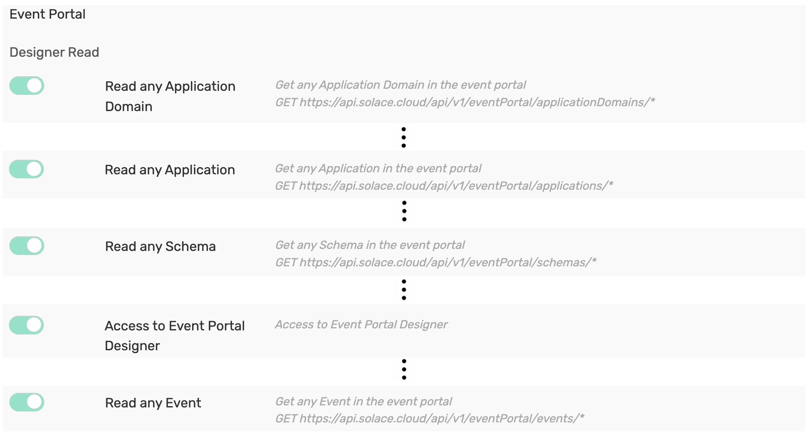

# Solace PubSub+ Event Portal + Slack Integration

## About

The Solace PubSub+ Event Portal integration for Slack gives you and your teams full visibility into your Event Portal resources right in Slack channels, where you can access information about your Application Domains, Applications, Events and Schemas. This integration is an open source project, built and maintained by _Solace-Labs_.

## Table of Contents
- [Solace PubSub+ Event Portal + Slack Integration](#solace-pubsub-event-portal--slack-integration)
  - [About](#about)
  - [Table of Contents](#table-of-contents)
  - [Installing the Solace PubSub+ Event Portal integration for Slack](#installing-the-solace-pubsub-event-portal-integration-for-slack)
    - [Requirements](#requirements)
    - [Installation](#installation)
  - [Getting Started](#getting-started)
  - [Resources](#resources)
  - [Contributing](#contributing)
  - [Authors](#authors)
  - [License](#license)

--------
## Installing the Solace PubSub+ Event Portal integration for Slack
### Requirements
This app supports access to Solace PubSub+ Event Portal using via Slack. You must have a Solace PubSub+ Cloud subscription and an API tokens with the following permissions.

To generate a token, Click on the User icon at the bottom of the sidebar and choose _Token Management_

In the *Create Token* page, grant all permissions under _Event Portal_ -> _Designer Read_ group.

Create the token and save it in a file, you would need to specify this token when registering for Solace Slack App.

### Installation
[Install the Solace PubSub+ Event Portal integration for Slack](https://slack.com/apps/A01BP7R4KNY-github) [_needs update_]. After you've signed in to your Slack workspace, you will be prompted to give the app access:

 <i>[_needs update_]</i>

After the app is installed, and once you've added the GitHub integration to the relevant channels using `/invite @solace` allowing the app to interact with your channel.

## Getting Started
Once you install the app, you can not interact with Solace PubSub+ Event Portal app as a Personal app or access from a channel. Once the app is installed in the workspace, the Solace PubSub+ Event Portal app is enabled in all the public channels. For private channels, you need to explicitly invite `/invite @solace`

At this point your Slack and Solace PubSub+ Event Portal is not linked. Invocation of a solace slash command `/solace` or `/solace xxxx`, uou will be prompted to register a valid Solace PubSub+ Cloud REST API token. 

Click on the _Register_ button to open the registration dialog. 

Enter the token generated in the previous step for _Solace Cloud REST API Token_ field and a valid URL domain (just the domain name) extracted from the Web URL of your Solace PubSub+ Event Portal and complete the registration.

## Resources

For more information try these resources:

- The Solace Developer Portal website at: https://solace.dev
- Ask the [Solace Community](https://solace.community)

## Contributing

Please read [CONTRIBUTING.md](CONTRIBUTING.md) for details on our code of conduct, and the process for submitting pull requests to us.

## Authors

See the list of [contributors](https://github.com/solacecommunity/<github-repo>/graphs/contributors) who participated in this project.

## License

See the [LICENSE](LICENSE) file for details.
