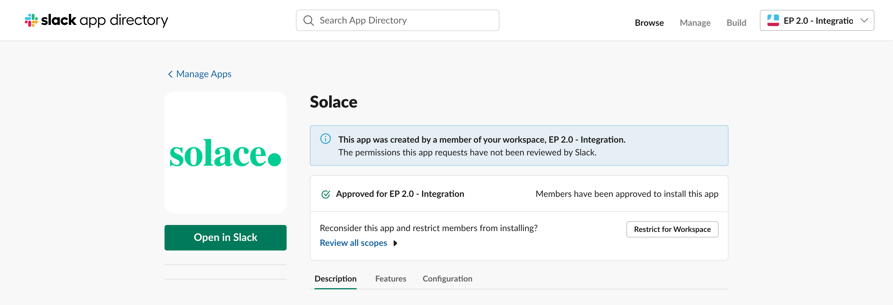

# Introduction

As part of the EP 2.0 Education & Tooling initiative, Slack is one of the considered integrations. The goal is to create a Slack app that enables Slack users to query EP 2.0 resources using Event Portal REST API within the Slack platform. The Slack app interactions would allow users to query and drill down EP Resources and unfurl valid EP 2.0 URLs.

Slack app interactions expose a read-only view of the EP artifacts in the Slack UI using the Slack components and templates. The current release of the Solace EP 2.0 App for Slack supports the following EP resources - Application Domains, Applications, Events, and Schemas. 

A Slack user must register a valid EP REST API Token to access App features. Refer to [EP 2.0 Integration – Solace EP 2.0 App for Slack User Guide](https://sol-jira.atlassian.net/wiki/spaces/CTOGrpDoc/pages/3157327952) on how to interact with the App. 

>**IMPORTANT**: Due to security and compliance requirements, Solace EP 2.0 App for Slack is NOT made available in the Slack Marketplace but only through manual installation. The link to initiate installation is [Solace EP 2.0 App for Slack Installation URL](https://slack.com/oauth/v2/authorize?client_id=3559375384807.3781079860292&scope=app_mentions:read,channels:history,channels:read,chat:write,commands,groups:history,im:history,links:read,links:write,mpim:history,mpim:read,mpim:write,chat:write.public&user_scope=chat:write,links:read,links:write).

# Install Solace EP 2.0 App for Slack
Solace EP 2.0 App for Slack can be installed on a Slack workspace by the Slack Administrator (or a user with appropriate privileges). 

1. Follow the [link](https://slack.com/oauth/v2/authorize?client_id=3559375384807.3781079860292&scope=app_mentions:read,channels:history,channels:read,chat:write,chat:write.public,commands,groups:history,im:history,im:read,im:write,links:read,links:write,mpim:history,mpim:read,mpim:write,chat:write.customize&user_scope=im:write,links:read,links:write,chat:write,mpim:write,im:history) to start the Solace EP 2.0 App for Slack installation.
2. Depending on the workspace you have currently logged in, it will open a page displaying the set of required permissions and a button to allow installation.

3. Click on the Allow button to proceed with the installation. You will be redirected to a page that warns about the ngrok mapped URL - It is ok to proceed; click on the Visit Site button. NOTE: The Solace EP 2.0 App for Slack backend currently uses the ngrok facility to provide HTTPS redirection to the local server. In the future, the App will host its HTTPS endpoint. It is ok to proceed!

4. After a successful installation, you will see a Thank You! page with a link to open the Slack App. 

OR

 
5. The App is now available for all users of the workspace. As a Slack Administrator, completing steps 1-5 would suffice to install and make the Solace EP 2.0 App for Slack accessible to all workspace users. You may skip the following steps if you do not want to test the interaction with the App.

6. You can now see the Solace EP 2.0 App for Slack appearing in the installed apps list in the Slack Application.

7. As a user, now you are ready to use the Solace EP 2.0 App for Slack, but first, you need to configure your EP REST API access token.

a. Create an Event Portal REST API token - [URL](https://console.solace.cloud/api-tokens/create) and copy the token string

b. Click on the __Register Token__ button.

i. Copy the generated token in the __Solace Cloud REST API Token__ textarea.

ii. Enter the domain name of the Event Portal URL in the __Solace Event Portal URL Domain__ field (strip out the https:// and other content of the Event Portal URL). The URL Domain name is required to identify valid Event Portal URLs for unfurling when you paste an EP URL into Slack. The domain name could vary depending on the hosting and cloud account type.

iii.Click on __Register__ to complete registration.

You can now view the registration details on the App Home page
9. 

10. IMPORTANT: Solace EP 2.0 App for Slack interactions is supported only in a channel context (any). As a first step, you need to invite the App as a member to participate in the conversation. You can do so by issuing the slash command `/invite solace` in the channel. Now, you can access all the app features from that channel.

11. In any of the Workspace channels, enter `/solace`; you can see the Solace App in action.

12. You can start by clicking on the Show help button or issuing the `/solace help` slash command.

# Uninstall Solace EP 2.0 App for Slack
Solace EP 2.0 App for Slack can be uninstalled from a Slack workspace by the Slack Administrator (or a user with appropriate privileges). 

1. In the Slack App, select the __Manage Apps__ option.

2. You will be redirected to the workspace management page., choose the __Installed Apps__ from the left sidebar and click on the __Solace__ app in the list.

3. Click on the __Open in App Directory__ link on the right sidebar.

4. You will be redirected to the App configuration page.

5. Click on the __Configuration__ tab and scroll to the bottom of the page.

6. Click on the __Remove App__ button.

7. In the Remove App pop-up, click on the __Remove App__ button

8. Now the Solace EP 2.0 App for Slack is removed from the workspace and won’t be available for use by any users.

 

You can reinstall the App again by following the installation steps anytime.

# Resources

For more information, try these resources:

Solace EP 2.0 App for Slack - [Installation Guide](https://sol-jira.atlassian.net/wiki/spaces/CTOGrpDoc/pages/3157622825)

Event Portal 2.0 [Overview](https://docs.solace.com/Cloud/Event-Portal/event-portal-overview.htm)

Event Portal Open API v2 - [Early Access](https://openapi-v2.solace.cloud/)

Ask the Solace [Community](https://solace.community/)