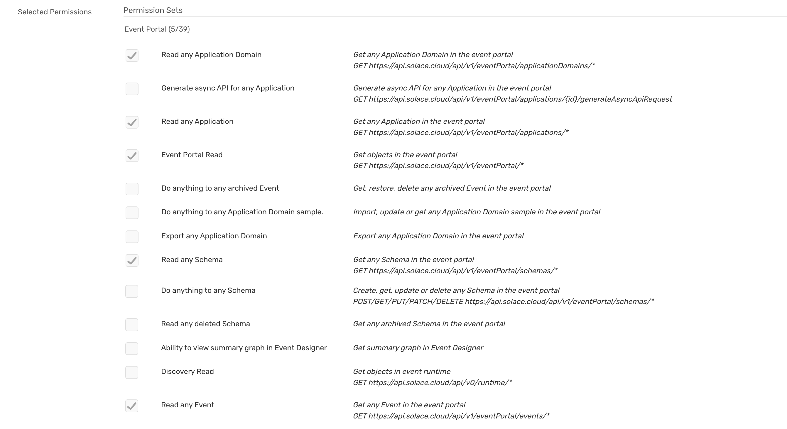

# Introduction

As part of the EP 2.0 Education & Tooling initiative, Slack is one of the considered integrations. The goal is to create a Slack app that enables Slack users to query EP 2.0 resources using Event Portal REST API within the Slack platform. The Slack app interactions would allow users to query and drill down EP Resources and unfurl valid EP 2.0 URLs.

Slack app interactions expose a read-only view of the EP artifacts in the Slack UI using the Slack components and templates. The current release of the Solace EP 2.0 App for Slack supports the following EP resources - Application Domains, Applications, Events, and Schemas.

The following table describes the types of interactions supported by the Solace EP 2.0 App for Slack.

|||
|---------|-------------------------|
| **Slash Commands**  | Interactions with Solace PubSub+ Event Portal exposing resources via slash commands - `/solace` command |
| **URL Unfurling**  | Exposing Event Portal resources represented by an Event Portal URL|
| **Interactivity** | Contextual interactions on the slash command or URL unfurled output to drill down and access child resources.|

# Solace EP 2.0 App for Slack in the Workspace

In the Slack App, check and make sure that you can see the Solace EP 2.0 App for Slack listed in the App listing. Contact your Slack Administrator to install the App on the workspace if it is not present. You can refer to the installation document for installing the App on your workspace.

Before using the Slack App, register a valid Event Portal REST API Token and Event Portal.

# API Token and Event Portal URL Domain Registration

Even though the installed Solace EP 2.0 App for Slack is available for all users, users must register their private API Token and URL domain names.

>**IMPORTANT**: Ensure that the  `New Event Portal 2.0` flag is turned on in the Cloud Console.

<ins>**Solace Event Portal REST API Token:**</ins> Let us generate an Event Portal REST API token. Login to Solace Cloud Console, click on the User icon at the bottom of the sidebar and choose Token Management.

In the Create Token page, grant permissions under Event Portal -> Designer Read group for the following options.

Create the token and save it in a file or clipboard; you would need to specify this token when registering for Solace EP 2.0 App for Slack.

<ins>**Solace Event Portal URL Domain:**</ins> Review your Solace Cloud Console URL and note the domain name.

For example, if your EP URL to Event Portal is __https://solace-sso.solace.cloud/ep/designer__, your domain name would be __solace-sso.solace.cloud__. Similarly, if the Event Portal URL is __https://console.solace.cloud/ep/designer__, your domain name would be __console.solace.cloud__.

You can initiate the registration by visiting the Solace EP 2.0 App for Slack’s Home page or by issuing the `/solace register` command on a channel.

##Register via the Solace EP 2.0 App for Slack Home page

1. Select the __Solace EP 2.0 App for Slack__ from the __Apps__ listing on the left sidebar
2. On the App’s Home, click on the __Register Token__ button.
3. Click on the _Register Token_ button.

  a. Copy the generated token in the __Solace Cloud REST API Token__ textarea.
  b. Enter the noted URL Domain __Solace Event Portal URL Domain__ field
  c. Click on __Register__ to complete registration.

##Register via the Slash Command

1. From a channel in the workspace, enter `/solace register` command
   

2. Click on the Register button 
  

a. Copy the generated token in the __Solace Cloud REST API Token__ textarea.
b. Enter the noted URL Domain __Solace Event Portal URL Domain__ field
c. Click on __Register__ to complete registration.

## Updating API Token or URL Domain

At any point in time, if you ever need to update the token or the domain name, you can do so by reissuing the slash command `/solace register` and clicking on the __Update__ button or the App’s __Home__ page, and following the steps in the previous section.

#Solace EP 2.0 App for Slack Features

A Slack user can interact with Solace EP 2.0 App for Slack using slash commands, interactions on the message content, and unfurl of valid EP URLs.

##Slash commands

The primary mode of Event Portal interaction is via slash commands. Following Event Portal resources can be queried through the Solace EP 2.0 App for Slack.

* Application domains
* Applications
* Events
* Schemas

You can always issue the slash command `/solace help` to get started.

   

Issue a `/solace examples` slash command or click the __Examples__ button under resource to see example commands for each resource type and supported options. Of course, you can share your feedback on the [Solace Community](https://solace.community/) or by clicking on the __Feedback__ button.

##Message interactions

Each Slack message generated as a result of a slash command represents an Event Portal resource. As appropriate, the messages are enriched with additional metrics like resource count, settings, etc. Further drill-down is supported via a drop-down menu option containing a list of dependent resources—for example, Applications in a Domain, Versions of an Event, etc.

* Application domains
  * Applications
  * Events
  * Schemas
   

* Applications
  * Versions
  * Events
  * Schemas
   

  
* Events
  * Versions
   

  
* Schemas
  * Versions

   

## URL Unfurling

One of the notable features of Slack is the ability to unfurl and present a preview (quick snapshot) of a URL. The Solace EP 2.0 App for Slack takes advantage of this, unfurls a valid Event Portal URL, and provides a preview.

When you paste an EP URL, the Solace EP 2.0 App for Slack introspects the URL, identifies the resource, retrieves information, and displays it with details and interactions for further drill down.

   

#Paginated results

Pagination is a process used to divide large data into smaller discrete pages, with the ability to control the view via _Page Number_ and _Page Size_. The App takes a default size of 5 as Page Size and appends a `Get more (x)` button when there are more to display.

   

Clicking the `Get more (6)` would fetch the next page, i.e., the next batch of 5 results. At the end of each batch, a `Get more (x)` button with x indicates the count of remaining results.

Eventually, when all the results are returned, the pagination ends as there will be no `Get more` button.

   

# Help

A simple `/solace help` command will set you up with all the supported commands and their options.

   

# Examples

Here is a set of examples for each of the supported slash commands.

   

# Resources

For more information, try these resources:

Solace EP 2.0 App for Slack - [Installation Guide](https://sol-jira.atlassian.net/wiki/spaces/CTOGrpDoc/pages/3157622825)

Event Portal 2.0 [Overview](https://docs.solace.com/Cloud/Event-Portal/event-portal-overview.htm)

Event Portal Open API v2 - [Early Access](https://openapi-v2.solace.cloud/)

Ask the Solace [Community](https://solace.community/)